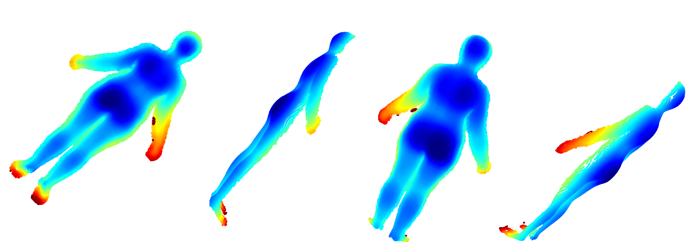

# Reconstruction
3D reconstruction from RGBD data.

Goal of this project is to predict back depth map of a person given the front depth map. Using the prediction and the front depth map we can reconstruct the person in 3D as a point cloud. An example resulting point cloud is shown below,



## Usage
First clone the project as follows,
```
git clone <url> <newprojname>
cd <newprojname>
```
Then build the project by using the following command, (assuming build is already installed in your virtual environment, if not then activate your virtual environment and use `conda install build`)
```
make build
```
Next, install the build wheel file as follows,
```
pip install <path to wheel file>
```

## Download data
To download a capture use the download data script, it requires the directory to download from gcp as follows,
```
gcloud auth login
./src/download_data.py -d <capture directory path relativeto bucket>
```

## Create Dataset
To train a model we need a dataset of front and back depth maps. This is created using the script in `src/create_dataset.py`. To run it use the following command in bash (assuing you are in root of this project),
```
./src/create_dataset.py
```
This will take a pointcloud and split it into front and back pointclouds and save their depth maps along with other necessary information for reconstruction.

I used the CAESAR fitted meshes dataset ([MPII human shape dataset](https://humanshape.mpi-inf.mpg.de/)) for training the model.

[1] L. Pishchulin, S. Wuhrer, T. Helten, C. Theobalt and B. Schiele. Building Statistical Shape Spaces for 3D Human Modeling. Pattern Recognition 2017

## Training
A notebook is avaialable in `notebooks/train_example.ipynb` for training the modified U-net model using the dataset created above.

## Inference
A notebook is avaialable in `notebooks/inference.ipynb` for inference using the trained model.

## Requirements
I used Anaconda with python3,

```
make install
conda activate cv3d-env
```